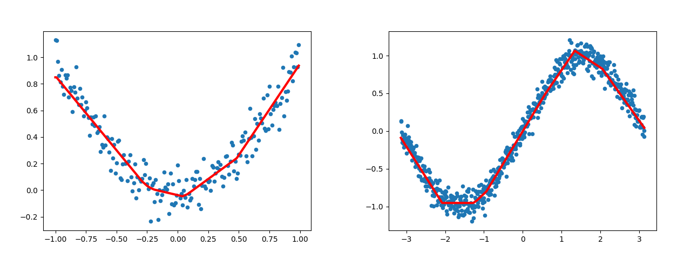
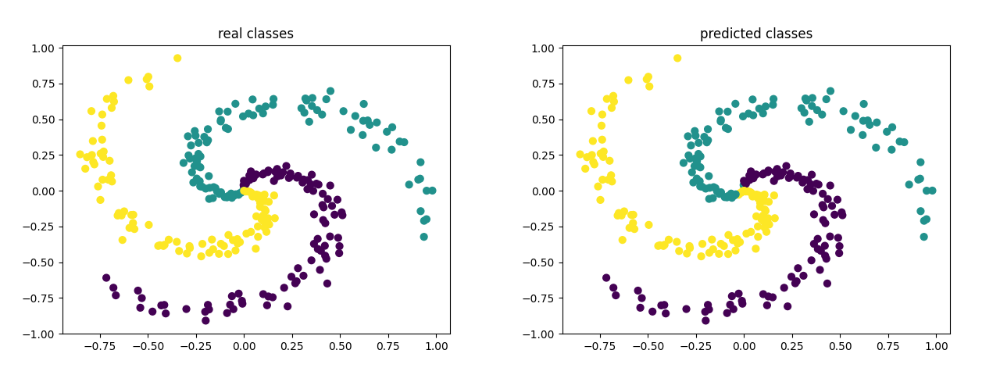
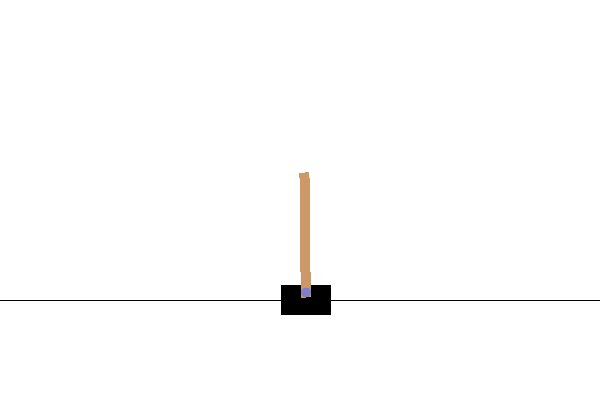

 [](http://makeapullrequest.com) [](https://github.com/Gowthambalan/DIY_Framework-Free_N_Network/actions/workflows/manual-ci.yml)[](https://pypi.python.org/pypi/DIY_Framework-Free_N_Network/#history)

# NN-Without-Frameworks
This project aims to implement different Neural Network configuration **without** using scientific frameworks like **TensorFlow** or **PyTorch**.

Each network/config is implemented in 4 formats while trying to get the best of both worlds of TensorFlow (+ Keras) and PyTorch :
1. In Python using NumPy
2. In Python without taking advantage of NumPy
3. In java
4. In C++

## What is currently supported? (equally in all languages and formats)
Layers:
- Fully Connected

Activations:
- Linear
- ReLU

Loss functions:
- MSE 
- Cross Entropy

Weight Initializers:
- Xavier Uniform (aka Glorot)
- He Normal (aka Kaiming Normal)

bias initializer:
- Constant (zero)

Optimizers:
- SGD
- SGD + Momentum
- RMSProp
- AdaGrad
- Adam

Regularizer:
- l1
- l2

Normalization:
- BatchNorm1d


## Examples

Each directory contains a `train.*` that performs tests of correctness and functionality according to its corresponding format and language. You can run it to get a sense of what is going on.

<p>

</p>  
<p>

</p>  

### DQN
<p align="center">

</p>  

## Snippet
**Define your network**
- Python:
```python
from nn_without_frameworks import numpy_nn as nn  # from nn_without_frameworks import pure_nn as nn


class MyNet(nn.Module):
    def __init__(self, input_dim, out_dim):
        super().__init__()
        self.input_dim = input_dim
        self.out_dim = out_dim
        self.hidden1 = nn.layers.Dense(in_features=self.input_dim,
                                       out_features=100,
                                       activation=nn.acts.ReLU(),
                                       weight_initializer=nn.inits.HeNormal(nn.acts.ReLU()),
                                       bias_initializer=nn.inits.Constant(0.),
                                       regularizer_type="l2",
                                       lam=1e-3
                                       )

        self.output = nn.layers.Dense(in_features=100,
                                      out_features=self.out_dim,
                                      weight_initializer=nn.inits.XavierUniform(),
                                      bias_initializer=nn.inits.Constant(0.),
                                      regularizer_type="l2",
                                      lam=1e-3
                                      )

    def forward(self, x):
        x = self.hidden1(x)
        return self.output(x)
```
- Java:
```java
import Layers.Dense;

class MyNet extends Module{
    int in_features = 0, out_features = 0;
    Dense hidden1, output;
    public MyNet(int in_features, int out_features){
        this.in_features = in_features;
        this.out_features = out_features;
        this.hidden1 = new Dense(this.in_features,
                100,
                "relu",
                "he_normal",
                "zeros",  // bias initializer
                "l2",
                0.001F);
        this.layers.add(this.hidden1); // the Crucial and only different part to PyTorch's subclassing
        
        this.output = new Dense(100,
                out_features,
                "linear",
                "xavier_uniform",
                "zeros",  // bias initializer
                "l2",
                0.001F);
        this.layers.add(this.output); // Crucial and different part to PyTorch's subclassing
    }

    public float[][] forward(float[][] x){
        x = this.hidden1.forward(x);
        x = this.output.forward(x);
        return x;
    }
}
```
- C++:
```cpp
#include <iostream>
#include <module.h>
#include <layers.h>

using namespace std;

class MyNet : public Module{
public:
    int in_features = 0, out_features = 0;
    Dense *hidden, *output; // Layers should be predifned especially, they should be pointers

    MyNet(int in_features, int out_features){
        this->in_features = in_features;
        this->out_features = out_features;

        this->hidden = new Dense{this->in_features,
                100,
                "relu",
                "he_normal",
                "zeros", // bias initializer
                "l2",
                0.001};
        this->parameters.push_back(this->hidden); // same as java

        this->output = new Dense{100,
                this->out_features,
                "linear",
                "xavier_uniform",
                "zeros", // bias initializer
                "l2",
                0.001};
        this->parameters.push_back(this->output); same as java
    }
    float_batch forward(const float_batch &input){ // float_batch =: vector<vector<float> >
        float_batch x = this->hidden->forward(input);
        x = this->output->forward(x);
        return x;

    }
};
```
__Train your network__

- Python
```python
my_net = MyNet(num_features, num_classes)
ce_loss = nn.losses.CrossEntropyLoss()
opt = nn.optims.SGD(my_net.parameters, lr=1.)
for step in range(epoch):
    y = my_net(x)
    loss = ce_loss(y, t)
    my_net.backward(loss)
    opt.apply()
```
- Java:
```java
import Losses.*;
import Optimizers.*;

MyNet my_net = new MyNet(num_features, num_classes);
CrossEntropyLoss celoss = new CrossEntropyLoss();
SGD opt = new SGD(1.0F, my_net.layers);

for (int epoch = 0; epoch < num_epoch; epoch++) {
    y = my_net.forward(x);
    Loss loss = celoss.apply(y, t);
    my_net.backward(loss);
    opt.apply();
}
```
- C++:
```cpp
#include <losses.h>
#include <optimizers.h>

MyNet my_net = MyNet{num_features, num_classes};
CrossEntropyLoss celoss;
SGD opt(1, my_net.parameters);
float_batch y;  // float_batch =: vector<vector<float> >
for(int step = 0; step < num_epoch; step++){
    y= my_net.forward(x);
    Loss loss = celoss.apply(y, t);
    my_net.backward(loss);
    opt.apply();
}
```
## Acknowledgement 
- Current code is inspired by the elegant and simple repository [Simple Neural Networks](https://github.com/MorvanZhou/simple-neural-networks) by [@MorvanZhou ](https://github.com/MorvanZhou).
- Mathematical foundation of different parts is based on slides of [CS W182 / 282A](https://cs182sp21.github.io/) and [CS231n](https://cs231n.github.io/) courses.
## Contributing
- The current code is far from done and any fix, suggestion, pull request, issue, etc is highly appreciated and welcome. 
- Current work focuses on discovering what is under the hood rather optimization involved in implementing ideas so, feel free to conduct sanity-checks behind the math and correctness of each part and/or if you come up with a better or optimized solution, please don't hesitate to bring up a PR. [thank you in advance..]
- You can take a look at `todo.md`.

